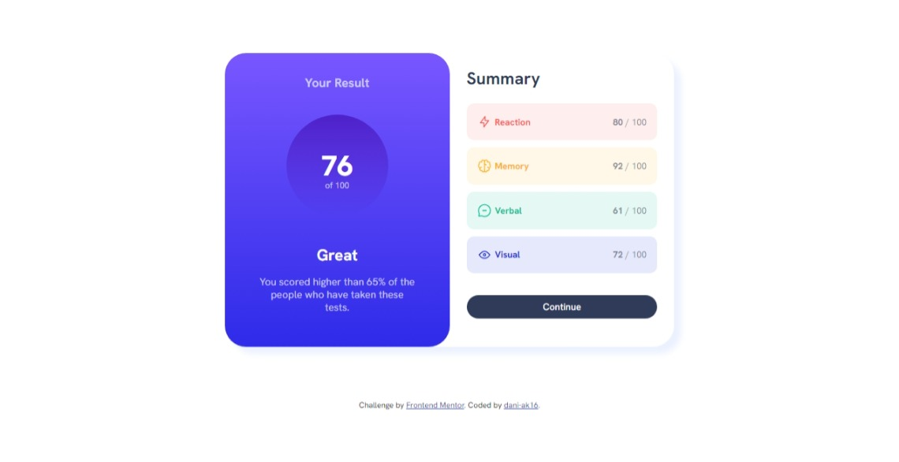

# Frontend Mentor - Results summary component solution

This is a solution to the [Results summary component challenge on Frontend Mentor](https://www.frontendmentor.io/challenges/results-summary-component-CE_K6s0maV). Frontend Mentor challenges help you improve your coding skills by building realistic projects. 

## Table of contents

- [Overview](#overview)
  - [The challenge](#the-challenge)
  - [Screenshot](#screenshot)
  - [Links](#links)
- [My process](#my-process)
  - [Built with](#built-with)
  - [What I learned](#what-i-learned)
  - [Continued development](#continued-development)
- [Author](#author)

## Overview

### The challenge

Users should be able to:

- View the optimal layout for the interface depending on their device's screen size
- See hover and focus states for all interactive elements on the page
- **Bonus**: Use the local JSON data to dynamically populate the content

### Screenshot

### Links
- Live Site URL: [Add live site URL here](https://dani-ak16.github.io/results-summary-component-main/)

## My process

### Built with

- Semantic HTML5 markup
- CSS 
- Flexbox

### What I learned

I learned a lot about responsive design as that part of this project was a bit challenging.

### Continued development

In future projects, I'd want to focus more on mobile-first approaches. I'd also want to become more comfortable using CSS custom properties.

## Author

- GitHub - (https://github.com/dani-ak16)